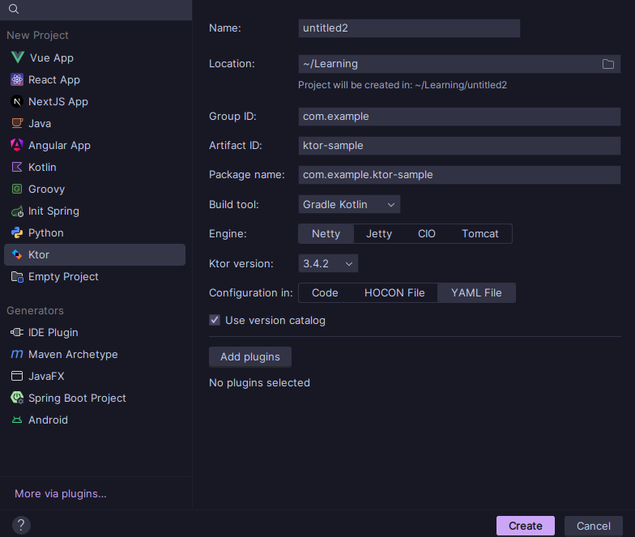
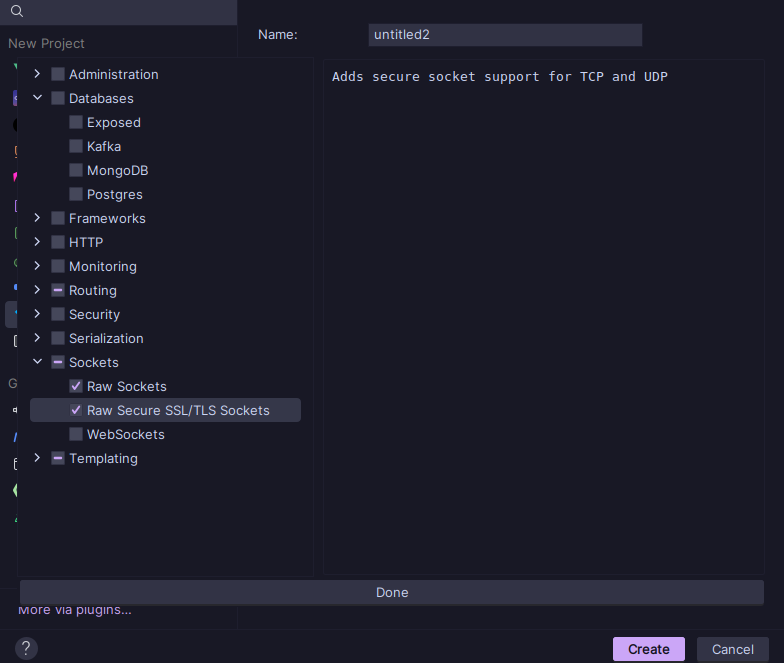

# Ktor init Plugin

Плагин предназначенный для создания проектов на Ktor прямо из IDE. 
Плагин является обёрткой над сайтом <a href="start.ktor.io">start.ktor.io</a>

## Как это выглядит в IDE

Все данные подтягиваются прямо с сайта

Вывод всех плагинов под выбранную версию Ktor + их описание

